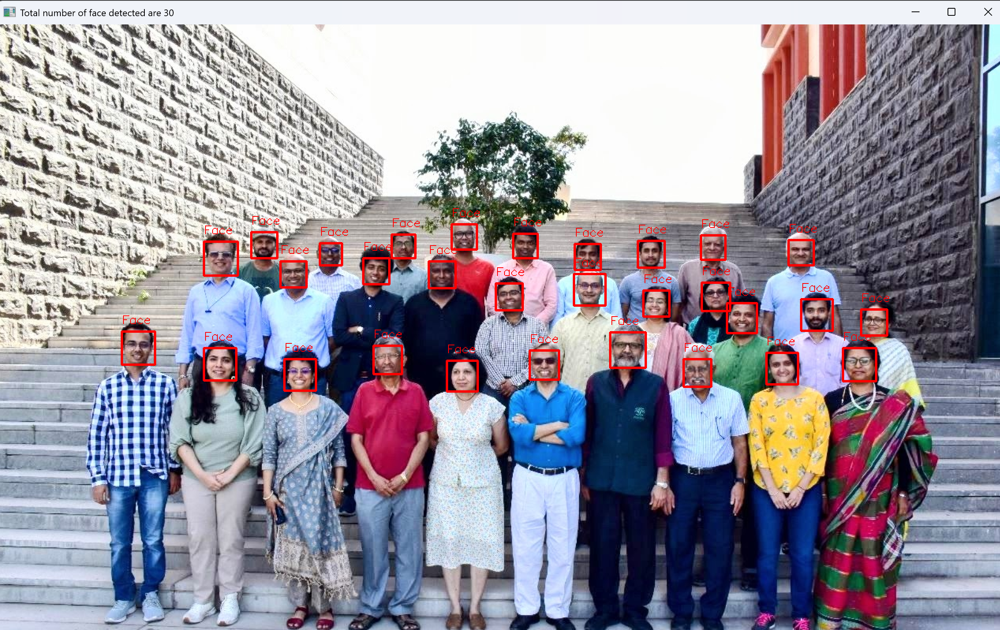
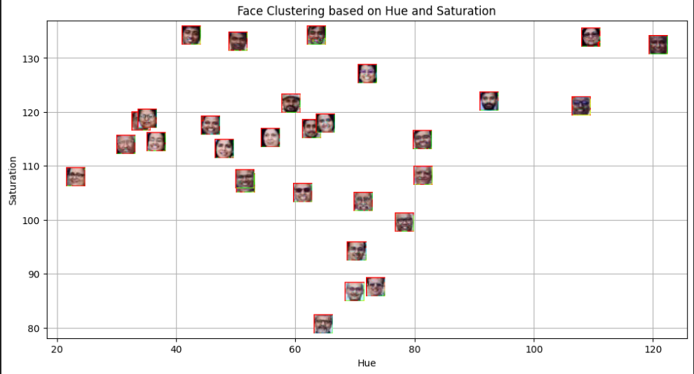

# Face Clustering using Computer Vision and Unsupervised Learning

## Aim
The objective of this lab is to detect human faces from an image, extract meaningful visual features, and group similar faces using **unsupervised machine learning techniques**. The study demonstrates how computer vision and clustering algorithms can be combined to analyze facial data without predefined labels.

---

## Methodology

The project follows a structured pipeline consisting of four main stages:

### 1. Face Detection
Faces are detected from an input image using a **Haar Cascade Classifier** provided by OpenCV. The image is first converted to grayscale to improve detection efficiency and accuracy.

**Visualisation:** Detected faces highlighted with bounding boxes.

---

### 2. Feature Extraction
Each detected face is converted from the BGR color space to the **HSV (Hue–Saturation–Value)** color space.  
For every face, the **mean Hue and mean Saturation values** are computed. These two values serve as compact numerical representations of facial color characteristics.

**Visualisation:** Cropped face regions used for feature extraction.

---

### 3. Unsupervised Clustering using K-Means
The extracted hue–saturation features are clustered using the **K-Means algorithm** with `k = 2`.  
Since no labels are provided, the algorithm groups faces solely based on similarity in color features.

**Visualisation:** Hue–Saturation scatter plot showing two clusters and their centroids.

---

### 4. Classification of a New Face
A separate template image is processed using the same detection and feature extraction pipeline.  
The trained K-Means model assigns this new face to the closest cluster based on Euclidean distance from cluster centroids.

**Visualisation:** Template face plotted alongside existing clusters.

---

## Key Findings

- Haar Cascade classifiers effectively detect multiple faces from a single image.
- HSV color features provide a compact and meaningful representation for clustering facial images.
- K-Means successfully groups faces with similar visual characteristics without requiring labeled data.
- A previously unseen face can be classified into an existing cluster using learned centroids.

---

## Conclusion

This lab demonstrates an end-to-end pipeline combining **computer vision** and **unsupervised learning** for facial analysis. While the clustering does not perform identity recognition, it effectively groups faces based on visual similarity. The approach highlights the importance of feature selection and consistency when applying machine learning techniques to image data.

**Limitations:**  
- Clustering is sensitive to lighting conditions.
- Color-based features alone are insufficient for reliable facial recognition.
- The number of clusters must be chosen manually.

Future improvements could involve texture-based features or deep learning embeddings for more robust analysis.
